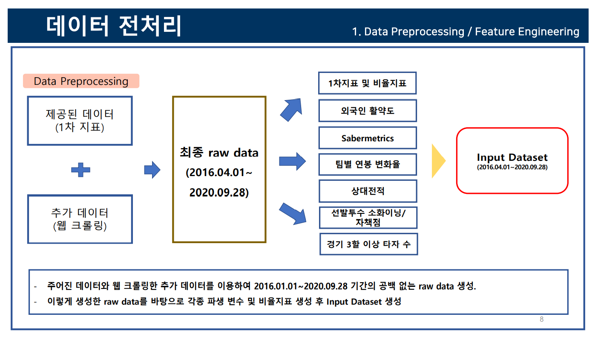
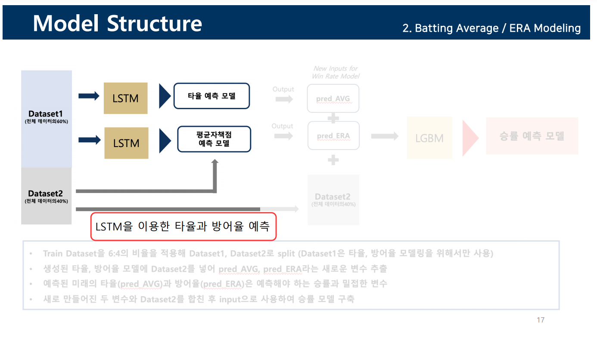
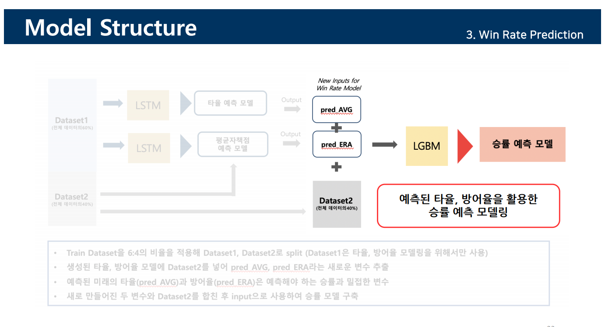

# Big Contest 퓨쳐스리그 (Future's Leage) -Team 10027- 

##### by 이경환, 김진영, 변영목, 홍기봉


## 분석 환경 및 사용 Packages (Analysis Environment and Packages Used)

### 1. 분석 환경 (Analysis Environment)

- OS: Windows  & MacOS & Linux-Ubuntu / RAM: 16GB

- Python == 3.7x version

- Pycharmproject / Jupyter Notebook 

  

### 2. 사용 주요 packages (Used Packages)

- beautifulsoup4==4.9.1

- bs4==0.0.1

- joblib==0.16.0

- Keras==2.4.3

- lightgbm==3.0.0

- numpy==1.19.2

- pandas==1.1.2

- selenium==3.141.0

- scikit-learn==0.23.2

- tensorflow==2.3.0

  


## 실행 방법 (Process Instructions)

0. (preprocess.py) 를 실행하여 raw_data를 나중에 사용할 Input으로 가공해줍니다. (해당 py의 실행으로 feature 추가 및 2020-07-21 ~ 2020-09-27의 크롤링 데이터까지 더해줍니다. - 이미 해놨습니다. )
- Run (preprocess.py) and preprocess the raw_data to Input data for later use. (The py adds the features and the crawled data from 2020-07-21 ~ 2020-09-27)

1. train.py를 실행합니다.(1차 rnn model과 2차 lightgbm model이 다 생성되고, MinMax 및 정규화 모델까지 저장됩니다.)
- Run train.py. (It will form the rnn model for the 1st phase and the ligthgbm model for the 2nd phase. It will save the MinMax and scaling model as well.)

2. predict.py를 실행합니다. (result폴더에 prediction.csv가 생성됩니다!)
- Run predict.py (It will create prediction.csv in the result folder)

3. 예측을 5회 반복하고 얻은 값들의 mean을 예측값으로 활용했습니다.
- The final predcition values are the mean of 5 different prediction runs.


** 가상환경설치 한 뒤, requirements.txt에 있는 pip들을 설치해야 합니다. (pip install -r requirements.txt를 치시면 됩니다!)   
** After creating a Virtual Environment, install the pips in requirements.txt. (type 'pip install -r requirements.txt'!)

  #### ※ 혹시라도 가상환경(Virtual Environment) 생성을 모른다면? (How to set up a Virtual Environment)

  ```bash
 #(리눅스 기준) (For Linux)
 # 1 코드를 실행 할 디렉토리에 들어가서 venv라는 이름의 가상환경을 생성한다.
 # Go to the directory where you will run the codes and make a Virtual Enviroment withe the name venv.
  python3 -m venv venv

  # 2 가상환경을 실행시켜준다. (디렉토리에 들어갔다는 가정)
  # Run the Virtual Environment 
  source bin/activate

  # 3 가상환경 실행 후, pip를 설치해준다.
  # After running the Virtual Environment, install the pips.
  pip3 -r install requirements.txt

  # ** 가상환경을 끄는 방법도 있다.
  # ** How to deactivate the Virtual Environment
  source deactivate

  ```









** 7월 19일 이후에 트레이드 한 선수 혹은 이후에 팀에 입단 한 외국인용병에 대한 인적사항은 따로 기입해줬습니다. 

** The Korean players who were traded after July 19th and the foreign players who joined the team after July 19th were registered separately.

2020   99999  팔카   SS   
2020   99998  러셀   WO      
2020   99997  화이트   SK   

2020   63950  장현식   HT   
2020   64984  김태진   HT   
2020   65643  문경찬   NC   
2020   65639  박정수   NC   
2020   63634  이홍구   KT   
2020   60558  오태곤   SK   


Copyright by 김진영(Jin Young Kim), 변영목(Young Mok Byon), 이경환(Kyung Hwan Lee), 홍기봉(Gi Bong Hong)
